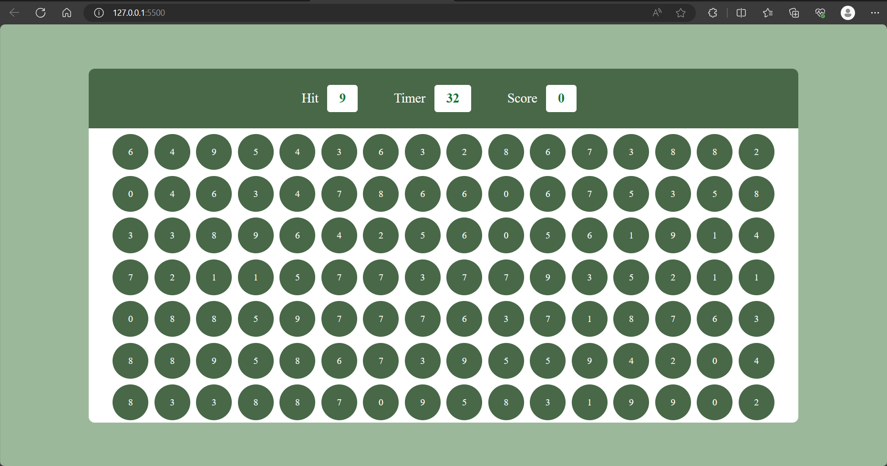

# BubbleGum Game



BubbleGum Game is a browser-based number matching arcade game. Match the number shown in the `Hit` panel before the timer runs out, build your score, and try to beat your saved high score.

## Live Demo

Enable GitHub Pages for this repository and use:

```text
https://sriram127.github.io/BubbleGum_Game/
```

## Features

- Start screen with difficulty selection
- Easy, medium, and hard modes
- Score, timer, target number, and best-score panels
- High score saved with `localStorage`
- Sound toggle for the game-over effect
- Play-again flow
- Responsive layout for desktop and mobile

## Tech Stack

- HTML
- CSS
- JavaScript

## Run Locally

Open `index.html` in a browser.

## How To Play

1. Choose a difficulty.
2. Press `Start Game`.
3. Click bubbles that match the number in the `Hit` box.
4. Each correct match adds 10 points.
5. Beat your best score before the timer reaches zero.
