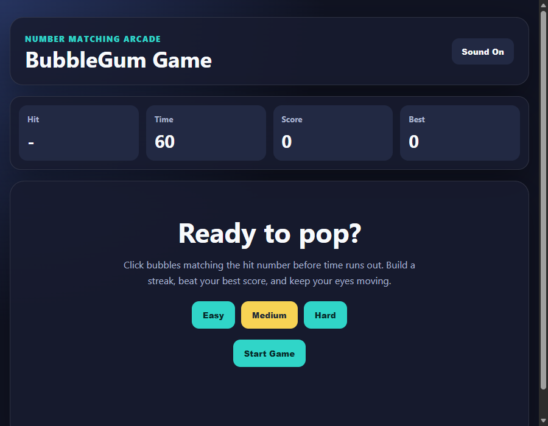

# BubbleGum Game

A browser-based number matching arcade game. Match the number shown in the **Hit** panel before the timer runs out, build your score, and beat your high score.

## Live Demo

**[Play Now on GitHub Pages](https://sriram127.github.io/BubbleGum_Game/)**

[](https://sriram127.github.io/BubbleGum_Game/)

## Screenshot



## Features

- Start screen with difficulty selection (Easy / Medium / Hard)
- Hit number panel with a live bubble grid
- Score, timer, target number, and best-score panels
- High score saved with `localStorage`
- Sound toggle for the game-over effect
- Play-again flow without page reload
- Responsive layout for desktop and mobile

## Tech Stack

- HTML5
- CSS3
- Vanilla JavaScript

## Run Locally

Open `index.html` directly in any browser — no build step or server required.

## How To Play

1. Choose a difficulty (Easy / Medium / Hard).
2. Press **Start Game**.
3. Click bubbles that match the number shown in the **Hit** box.
4. Each correct match adds 10 points.
5. Beat your best score before the timer reaches zero.

## Project Structure

```text
BubbleGum_Game/
├── index.html
├── style.css
├── script.js
├── screenshot.png
├── Bubble-Game.png
├── sfx-defeat3.mp3
├── README.md
└── .gitignore
```

## Deployment

This repository is automatically deployed to **GitHub Pages** via GitHub Actions on every push to `main`/`master`. The workflow file is at `.github/workflows/deploy.yml`.
